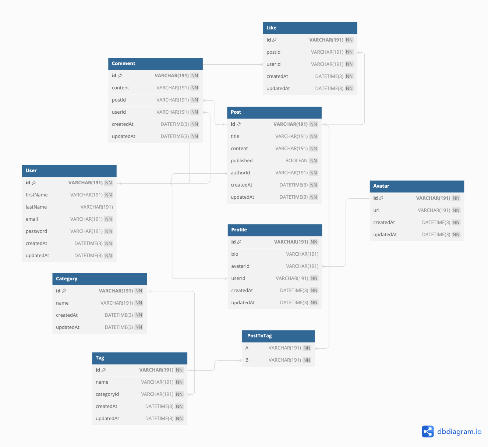

<!-- @format -->

# Facebowl GraphQL Blogging Website (Serverside)

## [Facebowl Clientside](https://github.com/pawpaw2022/gql-blogging-website-client)

Welcome to Facebowl, a powerful and efficient blogging website built using GraphQL and various modern technologies. This project leverages GraphQL, Apollo Server, Prisma, MySQL, Redis, TypeScript, and Node.js to provide a seamless and interactive blogging experience.

## Technologies Used

- **GraphQL:** A query language for APIs that enables efficient data fetching.
- **Apollo Server:** A GraphQL server that simplifies building GraphQL APIs.
- **Prisma:** A modern database toolkit for TypeScript and Node.js.
- **MySQL:** A robust relational database management system.
- **Redis:** A high-performance in-memory data store used for caching posts.
- **TypeScript:** A superset of JavaScript that adds static types.
- **Node.js:** A runtime environment for executing server-side JavaScript.

## Features

- Create, update, and delete data using GraphQL mutations.
- Fetch blog posts, comments, and user data with powerful GraphQL queries.
- Efficiently cache frequently accessed posts using Redis.
- Utilize TypeScript for type-safe development and enhanced code quality.
- Securely store user passwords using bcrypt.
- Authenticate users using JSON Web Tokens (JWT).
- Protect sensitive data using environment variables.

## Database Schema

<!-- Link -->

[Click to see more detail](https://dbdiagram.io/d/64e80c5102bd1c4a5e5ffb6c)

